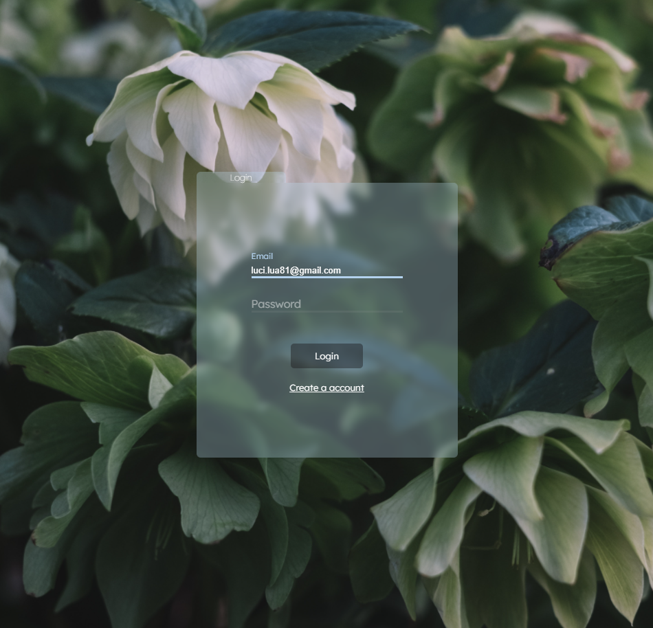
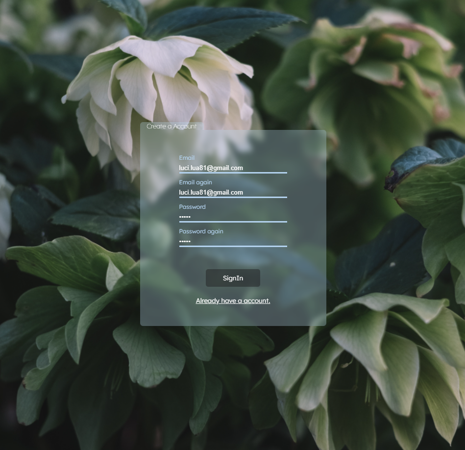

# <p align="center">☕ Local Storage: Login System ☕</p>
<p align="center">Login system using local storage</p>
<h1 align="center">
 
  

</br>
</h1>
</br>

## 🛠 Technologies used

    


## 🚀 How to start

> clone the repository
```bash
git clone https://github.com/LuciLua/localStorage.git
```

> open project folder
```bash
cd ./localStorage
```

> install all packages using npm or yarn manager (using YARN)

```bash
yarn
```

> start the development server (using YARN)

```bash
yarn dev
```

## 🖼 Preview

So far, this is the preview, but you can check it out at [this updated link](https://local-storage-azure.vercel.app//)


